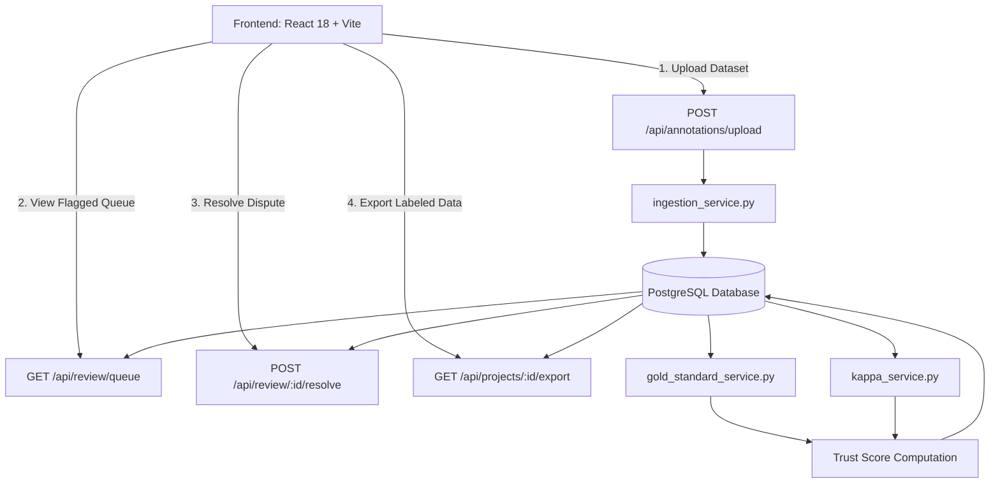

# 🛡️ Annotation Quality Guardian (AQG) — Current Project Status

**Repository:** [prembedre/annotation-quality-guardian](https://github.com/prembedre/annotation-quality-guardian)  
**Branch:** `main`  
**Current Milestone:** Phase 1 — MVP (Core Ingestion & Non-ML Quality Signals)  
**Status Date:** August 18, 2026  
**Overall Phase 1 Status:** 🟢 **100% Backend & Integration Complete**

---

## 1. Executive Summary

The **Annotation Quality Guardian (AQG)** platform provides automated quality auditing, trust scoring, and anomaly detection for machine learning data annotations. 

All three official remaining Phase 1 tasks for the **Backend & Integration** role have been fully developed, integrated into the FastAPI application, connected with PostgreSQL/SQLite, and verified with 18 automated unit and integration tests.

```
Phase 1 (MVP) Task Completion Tracker:
████████████████████████████████████████  100% (6/6 Tasks Complete)
```

---

## 2. Phase 1 Task Matrix

| # | Task | Deliverable | Status | Owner / Contributor |
|---|---|---|:---:|---|
| **1** | **PostgreSQL Schema & Models** | DDL tables, SQLAlchemy ORM models, Alembic migrations | 🟢 **Complete** | Database (Member 2) & Backend |
| **2** | **CSV / JSON Ingestion Engine** | `POST /api/annotations/upload` with normalization & deduplication | 🟢 **Complete** | Backend & Integration (You) |
| **3** | **Gold-Standard Accuracy Checker** | Computes per-annotator & project accuracy against gold data | 🟢 **Complete** | Scoring Engine (Member 3) |
| **4** | **Inter-Annotator Agreement (Kappa)** | Cohen's & Fleiss' Kappa multi-rater consensus scoring | 🟢 **Complete** | Scoring Engine (Member 3) |
| **5** | **Flagged-Item Review Queue** | `GET /api/review/queue` & `POST /api/review/{id}/resolve` | 🟢 **Complete** | Backend & Integration (You) |
| **6** | **Full-Dataset Export API** | `GET /api/projects/{id}/export?format=csv\|json` (Streaming) | 🟢 **Complete** | Backend & Integration (You) |

---

## 3. Module & Architectural Status



### 3.1 Backend & Integration (`backend/`)
- **FastAPI Core:** CORS middleware, application lifespan, centralized settings management.
- **SQLAlchemy ORM Models:** `Project`, `Item`, `Annotation`, `Annotator`, `TrustScore`.
- **Ingestion Pipeline:** Validates missing fields, types, confidence bounds, project `label_set` membership, and deduplicates `(project_id, external_id, annotator_id)`.
- **Review Queue System:** Fast SQL pagination (`page`, `page_size`) and multi-criteria filters (`project_id`, `flagged`, `min_score`, `max_score`, `annotator_id`, `search`).
- **Dataset Export:** Streaming CSV export and structured JSON export with denormalized annotations, annotator names, and trust metrics.

### 3.2 Database Layer (`database/` & `backend/migrations/`)
- PostgreSQL 15+ compatible DDL script in `database/schema.sql`.
- Alembic database migration scripts under `backend/migrations/`.
- Dynamic SQLite compatibility for isolated in-memory test environments.

### 3.3 Scoring Engine (`scoring/` & `backend/app/services/`)
- **Gold Standard Validation:** Calculates accuracy percentage per annotator and overall project hit rates.
- **Inter-Annotator Agreement:** Pairwise Cohen's Kappa and multi-rater Fleiss' Kappa matrix evaluation.
- **Standalone Live Demo:** `demo_report.py` executing CLI quality audits.

### 3.4 Frontend UI (`frontend/`)
- Single Page Application built with React 18 + Vite.
- Views ready for API connection: `Dashboard`, `Projects`, `Scores`.

---

## 4. API Endpoints Reference

| Method | Endpoint | Query / Body Params | Description |
| :--- | :--- | :--- | :--- |
| `POST` | `/api/annotations/upload` | Multipart: `file`, `project_id` | Ingests CSV or JSON annotation datasets |
| `GET` | `/api/review/queue` | `project_id`, `flagged`, `min_score`, `max_score`, `page`, `page_size` | Returns paginated items requiring human review |
| `POST` | `/api/review/{item_id}/resolve` | `{"ground_truth_label": "...", "notes": "..."}` | Assigns ground truth, unflags item, and marks resolved |
| `GET` | `/api/projects/{id}/export` | `format=csv` or `format=json` | Exports full project dataset with quality scores |
| `GET` | `/api/projects/` | `limit`, `offset` | Lists all projects |
| `POST` | `/api/projects/` | `{"name": "...", "label_set": [...]}` | Creates a new annotation project |
| `GET` | `/api/annotations/` | `project_id`, `annotator_id`, `limit`, `offset` | Lists individual annotations |
| `GET` | `/api/scores/` | `project_id` | Fetches project-level gold accuracy & Kappa scores |
| `GET` | `/health` | None | Health check & database connection ping |

---

## 5. Test Suite Verification

All **18 test cases** pass with zero errors:

```text
tests/backend/test_export.py::test_export_project_json PASSED            [  5%]
tests/backend/test_export.py::test_export_project_csv PASSED             [ 11%]
tests/backend/test_export.py::test_export_nonexistent_project PASSED     [ 16%]
tests/backend/test_export.py::test_export_invalid_format PASSED          [ 22%]
tests/backend/test_health.py::test_root_endpoint PASSED                  [ 27%]
tests/backend/test_health.py::test_health_check_endpoint PASSED          [ 33%]
tests/backend/test_ingestion.py::test_upload_valid_csv PASSED            [ 38%]
tests/backend/test_ingestion.py::test_upload_real_sample_annotations_csv PASSED [ 44%]
tests/backend/test_ingestion.py::test_upload_valid_json PASSED           [ 50%]
tests/backend/test_ingestion.py::test_upload_invalid_label_for_project PASSED [ 55%]
tests/backend/test_ingestion.py::test_upload_duplicate_detection PASSED  [ 61%]
tests/backend/test_ingestion.py::test_upload_empty_file PASSED           [ 66%]
tests/backend/test_ingestion.py::test_upload_unsupported_file_extension PASSED [ 72%]
tests/backend/test_models.py::test_create_item_and_annotator PASSED      [ 77%]
tests/backend/test_models.py::test_create_annotation_and_trust_score PASSED [ 83%]
tests/backend/test_review_queue.py::test_review_queue_pagination_and_filtering PASSED [ 88%]
tests/backend/test_review_queue.py::test_resolve_review_item PASSED      [ 94%]
tests/backend/test_review_queue.py::test_resolve_nonexistent_item PASSED [100%]

====================== 18 passed in 0.87s =======================
```

---

## 6. Recent Git Commit Log

* `172af76` — `docs: document phase 1 backend apis`
* `b371727` — `test: add backend integration tests`
* `cc98ff2` — `feat: add dataset export api`
* `0694a40` — `feat: add flagged item review queue api`
* `fe502fc` — `feat: complete csv json annotation ingestion`
* `8ab9051` — `Add script to seed sample flagged records for testing`
* `b7abf88` — `Implement Fleiss' Kappa calculation for annotations`
* `68e831f` — `Implement gold-standard accuracy calculation service`
* `7b0d786` — `Add file upload endpoint for data ingestion`
* `3456ddb` — `Add data ingestion service for CSV and JSON files`
* `049dac2` — `feat: initial commit - setup project scaffold, backend, db models, scoring engine, frontend`

---

## 7. Next Steps & Phase 2 Roadmap

1. **Frontend Integration:** Connect the React upload modal, review queue table, and export button to the corresponding backend endpoints.
2. **Phase 2 (ML Quality Signals):**
   - Behavioral Anomaly Detection (annotator speed / duration metrics).
   - Embedding Outlier Detection (vector distance from centroid for text/image representations).
   - Weighted Composite Trust Score calculation combining all 4 signals.
